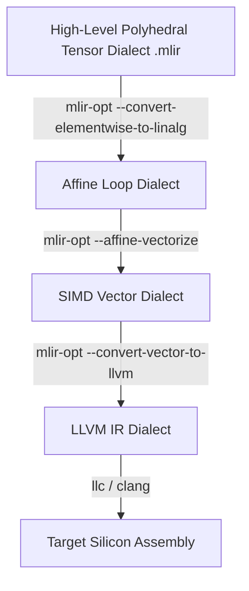

# MLIR-COMPILER-INFRASTRUCTURE
# Progressive Polyhedral Tensor Dialect Pipeline (MLIR)

## Executive Overview
A domain-specific compiler infrastructure written in **Multi-Level Intermediate Representation (MLIR)**. It implements custom tensor contractions and lowering transformations, progressively lowering high-level polyhedral tensor dialects to the **Affine**, **Vector**, and **LLVM** dialects for optimised silicon execution.

## Progressive Multi-Stage Lowering Pipeline



### Source Tree
- **`src/poly_tensor_dialect.mlir`**: MLIR source file defining tensor operations, dimensions, and types.
- **`lower_pipeline.sh`**: Execution script orchestrating progressive lowering passes with `mlir-opt`.
- **`runner/run.js`**: Structural AST validator ensuring correct MLIR operation lowering.

## Native MLIR Lowering Execution
```bash
bash lower_pipeline.sh
```

## Universal Verification
```bash
node runner/run.js
node orchestrator/run.js --project=27-mlir
```

## Senior Interview Q&A
- **Q: Why use MLIR instead of going directly to LLVM IR?** LLVM IR is too low-level: multidimensional tensor structure, loop nest geometry, and memory access affinities are lost during early lowering. MLIR preserves structural abstractions, enabling high-level polyhedral loop tiling and fusion before generating scalar instructions.
- **Q: What is a dialect in MLIR?** A dialect is a modular, self-contained namespace of operations, types, and attributes (e.g., `tensor`, `linalg`, `affine`, `vector`) that can coexist within the same module and lower progressively.\n
